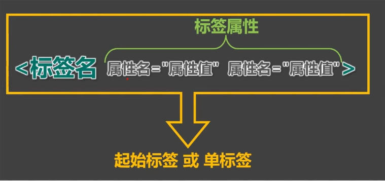

# HTML

## 简介

全称：HyperText Markup Language  超文本标记语言

标记：文本要变成超文本，就需要用到各种标记符号

语言：每一个编辑的写法、读音、使用规则，构成标记语言

发展史：

HTML标签：

标签属性：

> 空格分割、不可重复（后面写的不生效）；
>
> 用于给标签提供 附加信息；
>
> 可以写在起始标签 或单标签 中；
>
> 有些特殊的属性，没有属性名，只有属性值，`<input disable />`

HTML基本结构：

## HTML注释

`<!-- -->`